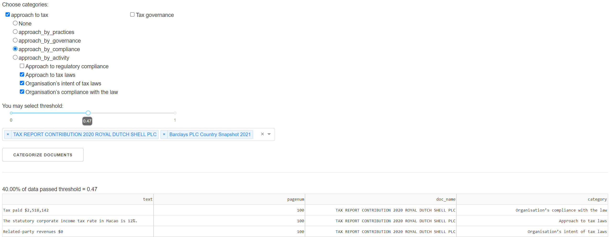

# ESGnie categoriser
## Instal
```
    poetry install
```

## Run
```
    poetry shell
    python app.py
```
Go to http://127.0.0.1:8050/

## Run tests and linters
```
    make tests
    make pretty lint
```


